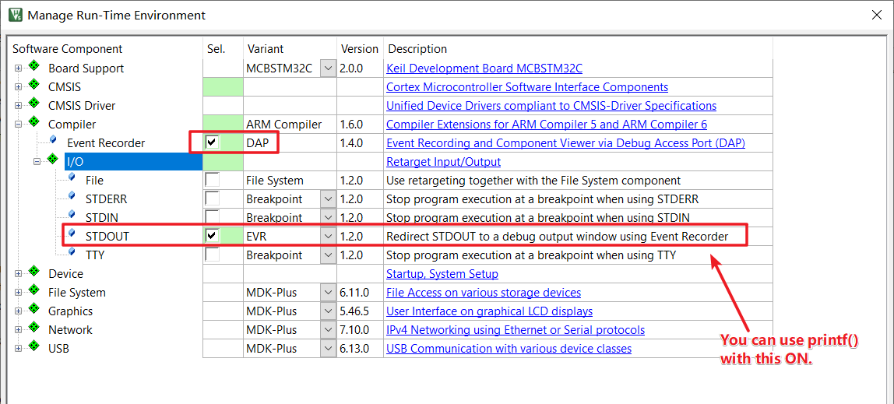
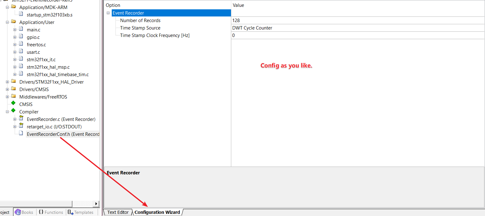
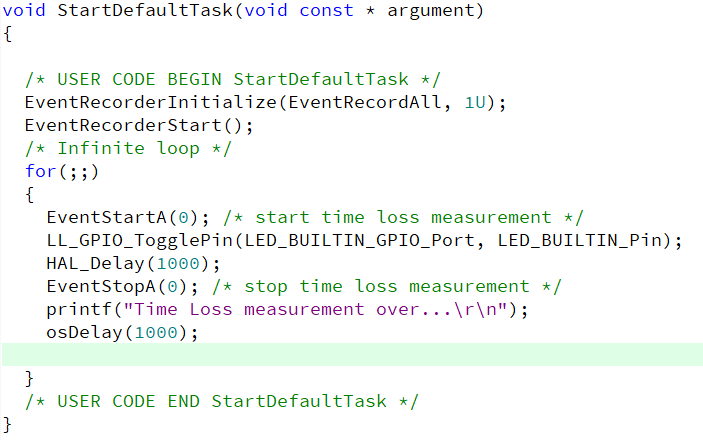
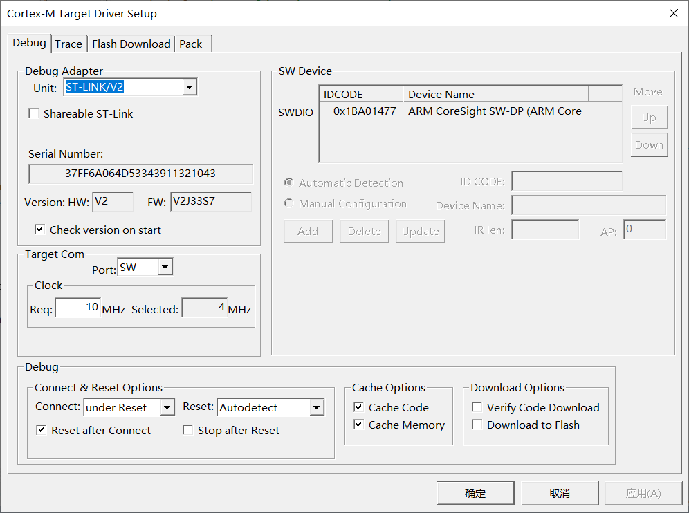
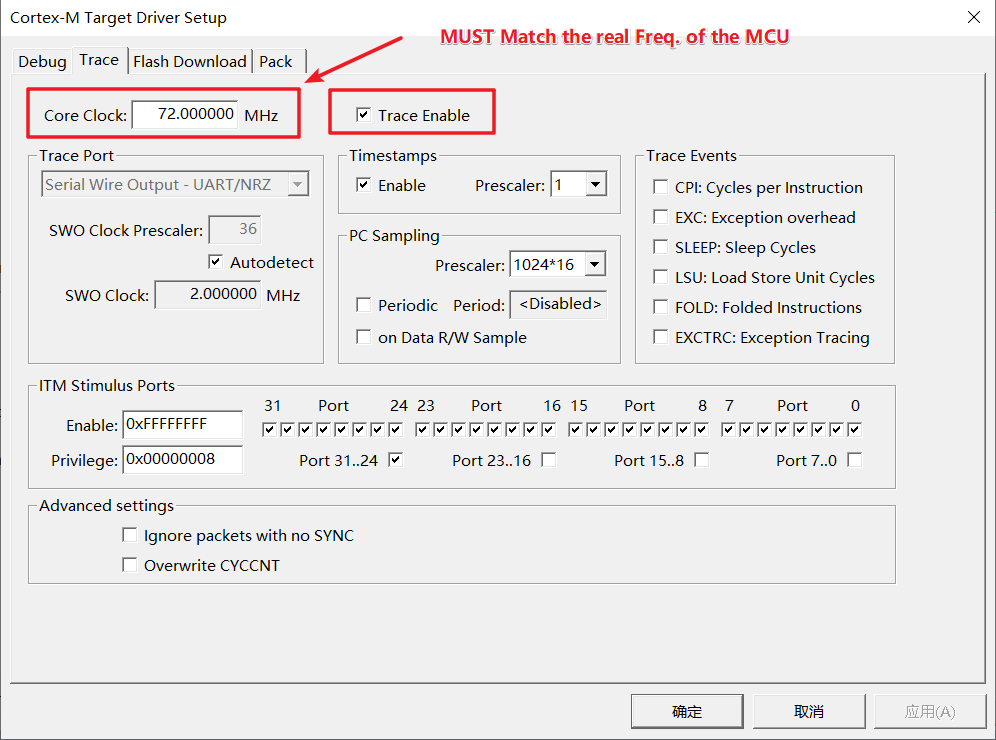
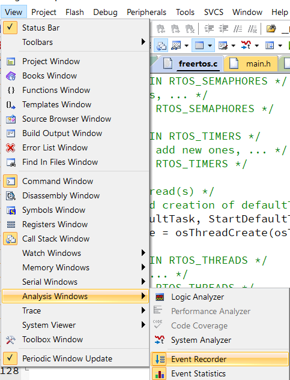
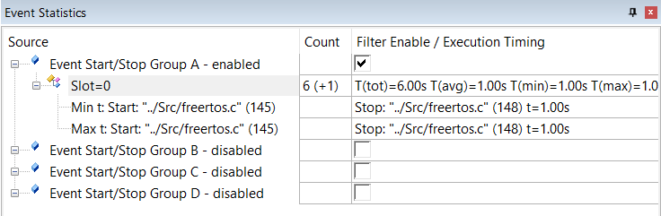
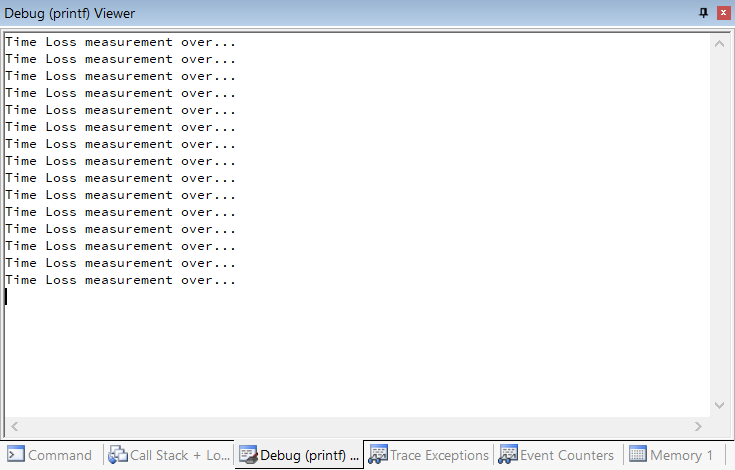

# HOW TO USE EVENT-RECORDER IN KEIL5

- Add Compiler Component like this.

  

  

- Config  Event Recorder.

  

- Add your code.

  The code showed belowing will measure time loss between

  `EventStartA(0);` and `EventStopA(0);`.

  

- Compile your code.

- Config your debugger.

  

  

- Enter debug mode.

- Enable Event Recorder.

  

- Then you'll get this.

  

  

